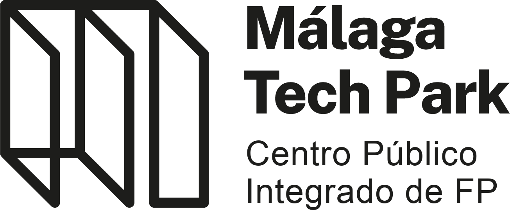
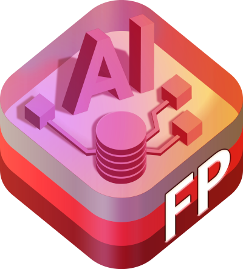

&nbsp;&nbsp;&nbsp;&nbsp;&nbsp;&nbsp;&nbsp;&nbsp;&nbsp;&nbsp;&nbsp;&nbsp;

# Trabajos Fin de Máster - Curso 2022 / 2023

En este repositorio se encuentra centralizada toda la información relativa a los **Trabajos Fin de Máster del Curso de Especialización en Inteligencia Artificial y Big Data del CPIFP Málaga Tech Park**, en la convocatoria del curso 2022 / 2023.

## Índice

* [Relación de Trabajos Fin de Máster](#relación-de-trabajos-fin-de-máster)
* [Requisitos y criterios](#requisitos-y-criterios)
* [Código y documentación a entregar](#código-y-documentación-a-entregar)
* [Fechas a tener en cuenta](#fechas-a-tener-en-cuenta)
* [Cuadrante horario de las exposiciones](#cuadrante-horario-de-las-exposiciones)
* [Evaluación del TFM](#evaluación-del-tfm)

## Relación de Trabajos Fin de Máster

Cada pareja debe cumplimentar la siguiente tabla:

| Pareja | Primer integrante   | Segundo integrante  | Título del TFM | Enlace al repositorio                            |
|:------:|:-------------------:|:-------------------:|:--------------:|:------------------------------------------------:|
|    1   | Oscar Pörtner Ostos | Juan Cerezo Serrano | Paddok         | https://github.com/Legodark/paddok               |
|    2   | Miguel Gámez Ruiz   | Sergio Toscano Díaz | MalagaHouse    | https://github.com/sergiotoscanodiaz/MalagaHouse |
|    3   |                     |                     |                |                                                  |
|    4   | Flores Chamizo Serrano | Diego Valenzuela Perez | P.E.T | https://github.com/fl0rch/Pet_Enhacement_Transition |
|    5   |                     |                     |                |                                                  |
|    6   |                     |                     |                |                                                  |
|    7   |                     |                     |                |                                                  |

## Requisitos y criterios

El proyecto se realiza por parejas elegidas por sorteo y la nota de ambos alumnos será la nota del proyecto.

El Trabajo de Fin de Máster consiste en la realización de un proyecto de Inteligencia Artificial y Big Data que incluya los siguientes apartados:

1. Justificación y descripción del proyecto.
2. Obtención de datos. Se debe especificar la fuente de los datos. Se indicará por qué medios se han obtenido (encuestas, sensores, scrapping, etc.)
Los datos se deben cargar en una estructura que permita su posterior manipulación y uso.
3. Limpieza de datos (eliminación de nulos y datos erróneos, etc.)
Descripción de los datos. Se debe dar una descripción completa de los datos indicando qué significa cada uno de los atributos.
4. Exploración y visualización de los datos. Se realizará un estudio de los datos buscando correlaciones, mostrando gráficas de diferente tipología, observando si hay valores nulos, etc.
5. Preparación de los datos para los algoritmos de Machine Learning. Se deben tratar los datos (limpiando, escalando, separando y todo lo que sea necesario) de tal forma que queden listos para entrenar el modelo.
6. Entrenamiento del modelo y comprobación del rendimiento.  Se entrenarán uno o varios modelos, comprobando en cada caso el rendimiento que ofrecen mediante las apropiadas medidas de error y/o acierto.
7. El TFM debe incluir alguna de las aplicaciones estudiadas en el tema de Procesamiento de Lenguaje Natural: reconocimiento de voz, síntesis de texto a voz, etc.
8. Se debe realizar también una aplicación web que haga uso del modelo entrenado.
9. Conclusiones. Se expondrán las conclusiones que se han obtenido en la realización del TFM.

## Código y documentación a entregar

Todo el material debe estar incluido o enlazado en el repositorio del TFM de cada grupo.

El repositorio debe contener lo siguiente:
  * Título
  * Descripción
  * Código fuente
  * Presentación en formato PDF. Se puede utilizar como apoyo para la exposición cualquier otro formato de presentación pero es obligatorio incluir siempre la presentación en PDF en el repositorio.
  * Enlace a la aplicación web.
  * Recursos utilizados (procedencia de los datos, manuales o tutoriales consultados, etc.).
  * Vídeo de 10 minutos máximo, donde el grupo exponga brevemente su proyecto y muestre su funcionamiento. Es muy importante hacer una introducción diciendo el nombre de la aplicación y de qué trata en una frase, antes de pasar a los detalles técnicos.

## 🗓️ Fechas a tener en cuenta

* Sorteo de parejas y explicación del TFM: lunes 23 de enero
* Comienzo del proyecto: lunes 13 de febrero
* Fecha límite de creación del repositorio del TFM con el título, el punto 1 de los requisitos (justificación y descripción) y enlazado en este repositorio-índice: lunes 13 de febrero
* Revisión (checkpoint) : viernes 24 de febrero (el jueves por la noche debe estar actualizado el repositorio con los últimos cambios).
* Fecha límite para subir todo el material que se pide sobre el TFM: domingo 12 de marzo a las 23:00h.
* Exposiciones generales: lunes 13 de marzo de 2023
* Sesión de evaluación del 2º trimestre: jueves 16 de marzo de 2023
* Exposiciones para Accenture: viernes 17 de marzo de 2023

## ⏰ Cuadrante horario de las exposiciones

La duración de cada exposición será de 20 minutos (15 de exposición y 5 de preguntas), dejando un margen de otros 5 minutos para el cambio. Todos los alumnos deberán estar presentes desde las 9:15h

### :calendar: lunes 13 de marzo de 2023

* 09:15h - 09:35h - Pareja 1
* 09:40h - 10:00h - Pareja 2
* 10:05h - 10:25h - Pareja 3
* 10:30h - 10:50h - Pareja 4

 🥪 D E S C A N S O ☕

* 11:20h - 11:40h - Pareja 5
* 11:45h - 12:05h - Pareja 6
* 12:10h - 12:30h - Pareja 7

### :calendar: viernes 17 de marzo de 2023

Exposición de los tres mejores TFM a Accenture.

La duración de cada exposición será de 20 minutos (15 de exposición y 5 o 10 de preguntas). 

* 09:30h - 10:00h 🏅 Pareja seleccionada 1
* 10:00h - 10:30h 🏅 Pareja seleccionada 2
* 10:30h - 11:00h 🏅 Pareja seleccionada 3

## 📝 Evaluación del TFM

La nota de ambos alumnos será la nota del TFM.

Para la elección de los tres mejores proyectos que se expondrán a Accenture se tienen en cuenta los votos de los alumnos de forma individual con un 30% de peso y los votos de los profesores con un 70% de peso. Un alumno no puede votar por su propio equipo.

